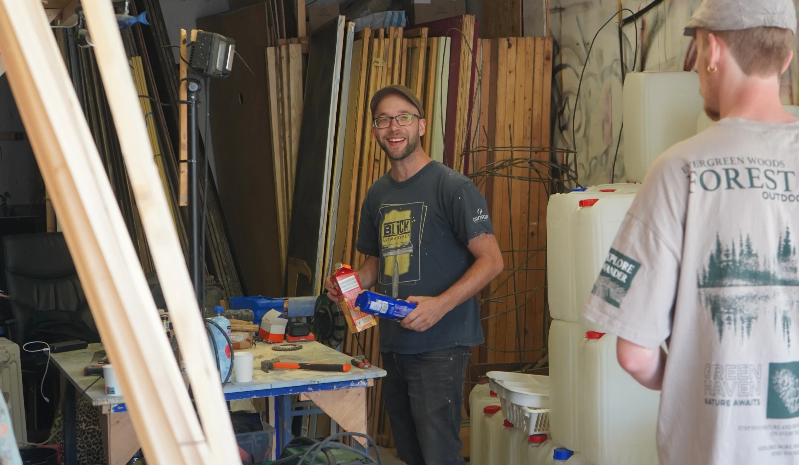
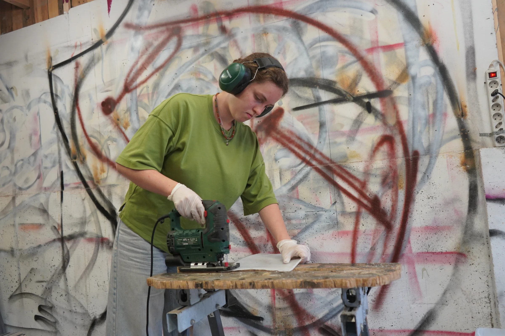
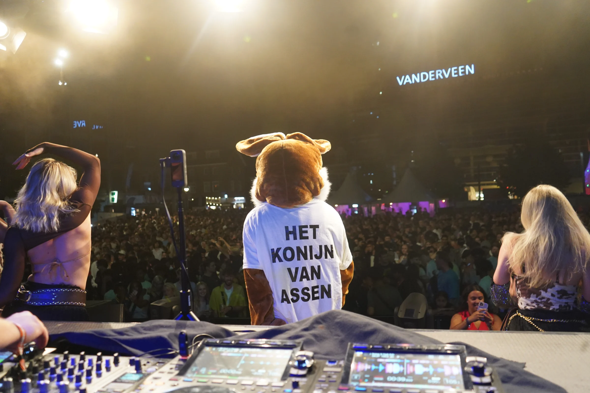
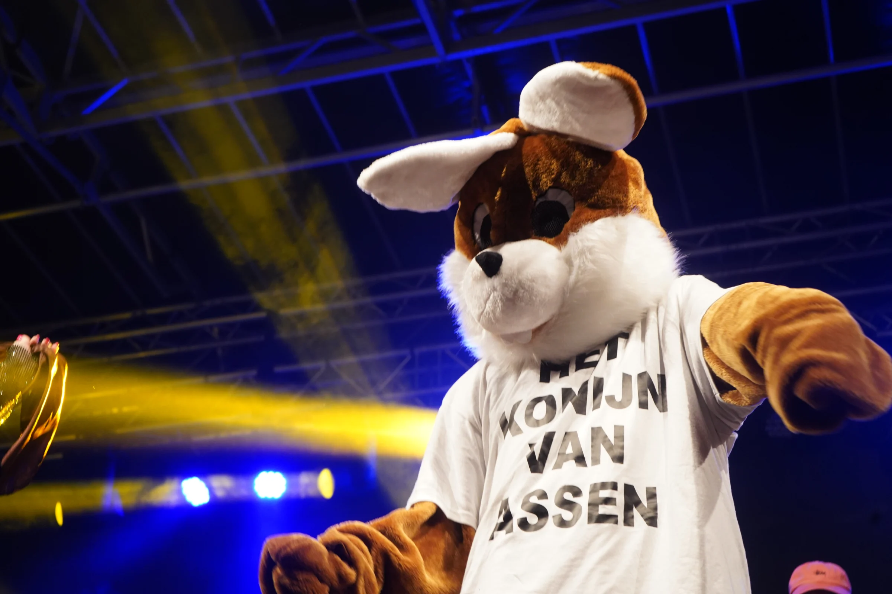
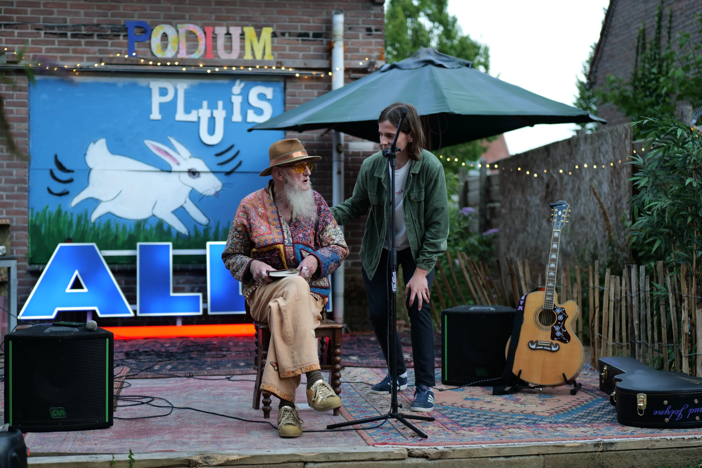
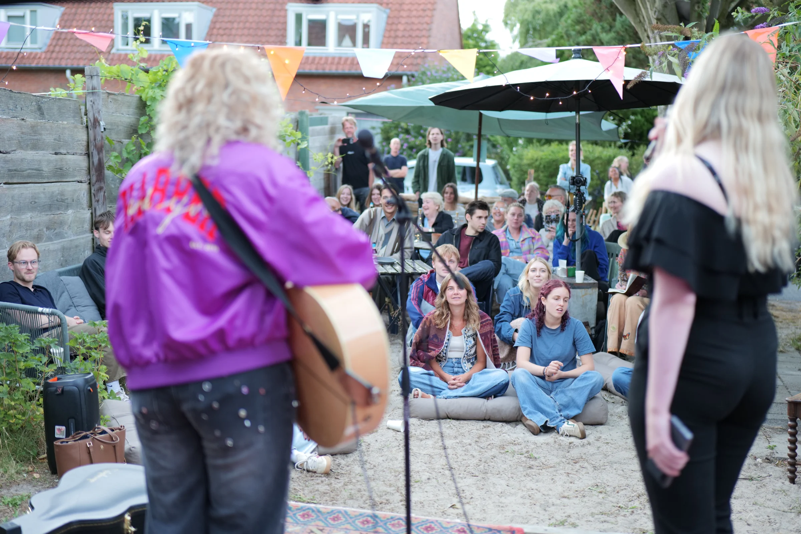

Weg met Mannes! Leve het Konijn van 'Olland ;)

We vonden het de hoogste tijd voor een stadseigen symbool: het Konijn van Olland. Een verwijzing naar Lodewijk Napoleon, die het toen nog kleine Assen in 1809 stadsrechten gaf.

Deze eerste koning van het Koninkrijk Holland staat bekend om zijn uitspraak: “Iek ben Konijn van Olland!” Het ontwerp van het Konijn door Michel Velt^

In oktober 2025 hadden we (BEGR!P) voor het eerst contact met kunstenaar Michel Velt. Hij heeft vaker grote beelden gebouwd. Hij was enthousiast over het idee om een konijn te bouwen. Onder zijn leiding zijn we aan de slag gegaan^ 

We zaagden jerrycans van de wasstraat in stukken en schroefden die op een constructie van staal en hout.^ 

Daarna was het tijd om te schuren, zodat de verf beter kan hechten.^

Naast het beeld is er meer te vinden in de stad. In de etalage van Vanderveen wordt een geheim onthuld^ Tijdens TT lanceerde we de nieuwe mascotte van Assen^Rondom de bouw van het Konijn organiseerden we deze zomer vijf keer Podium Pluis in de Schildersbuurt in Assen-Oost. Een podium voor lokaal talent.

